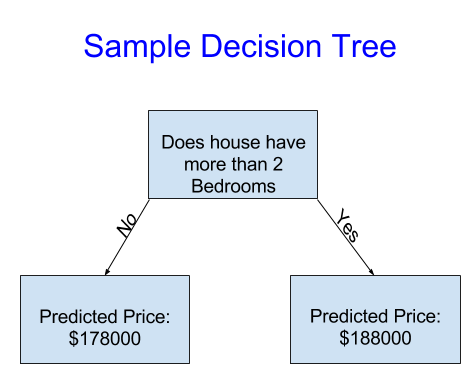
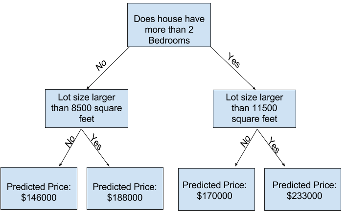
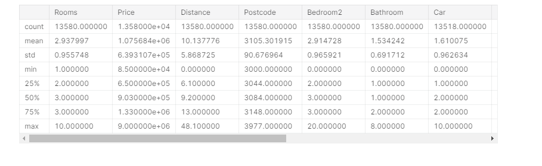
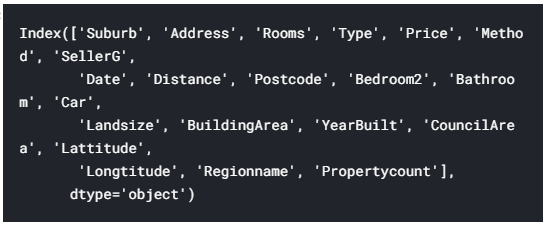

   你的堂兄已经赚了数百万美元 (草) ，投机房地产。 由于您对数据科学的兴趣，他愿意与您成为业务合作伙伴。 他将提供资金，并且您将提供可预测各种房屋价值的模型。
  您问

您的堂兄，他过去如何预测房地产价值。 他说这只是直觉。 但是更多的质疑显示他从过去的房屋中识别出了价格模式，然后他利用这些模式对他正在考虑的新房屋做出预测。
  
               简单决策树
               它将房屋仅分为两类。 所考虑的任何房屋的预测价格为同一类别房屋的历史平均价格。

我们使用数据来决定如何将房屋分为两组，然后再次确定每组中的预测价格。 从数据捕获模式的这一步骤称为拟合或训练模型。 用于拟合模型的数据称为训练数据。

有关模型拟合方式的详细信息（例如如何拆分数据）非常复杂，我们将其保存以备后用。 模型拟合后，您可以将其应用于新数据，以预测其他房屋的价格。

Improving the Decision Tree

左侧的决策树（决策树1）可能更有意义，因为它反映了一个事实，即卧室多的房屋比卧室少的房屋的价格更高。 该模型的最大缺点是，它没有涵盖影响房价的大多数因素，例如浴室数量，地段大小，位置等。

您可以使用具有更多“分裂”的树来捕获更多因素。 这些被称为“更深”的树。 决策树还考虑了每个房屋的总面积，可能看起来像这样：


您可以通过跟踪决策树来预测任何房屋的价格，并始终选择与房屋特征相对应的路径。 房屋的预计价格在树的底部。 我们进行预测的底部点称为叶子。

叶子上的拆分和值将由数据确定，因此是时候检查要使用的数据了。

Using Pandas to Get Familiar With Your Data
任何机器学习项目的第一步都是使自己熟悉数据。 您将为此使用Pandas库。 熊猫是科学家用来探索和处理数据的主要工具。 大多数人在其代码中将panda缩写为panda。 我们使用命令执行此操作

`import pandas as pd`


熊猫库中最重要的部分是DataFrame。 DataFrame包含您可能认为是表的数据类型。 这类似于Excel中的工作表或SQL数据库中的表。

Pandas具有强大的方法，可用于处理此类数据的大多数事情。

例如，我们将查看澳大利亚墨尔本的房价数据。 在动手练习中，您将对新数据集应用相同的过程，该数据集的价格位于爱荷华州。

示例（墨尔本）数据位于文件路径../input/melbourne-housing-snapshot/melb_data.csv中。

我们使用以下命令加载和浏览数据：
```
# save filepath to variable for easier access

melbourne_file_path = '../input/melbourne-housing-snapshot/melb_data.csv'

# read the data and store data in DataFrame titled melbourne_data

melbourne_data = pd.read_csv(melbourne_file_path)

# print a summary of the data in Melbourne data

melbourne_data.describe()
```



解释数据说明
结果显示原始数据集中每列有8个数字。 第一个数字（计数）显示有多少行具有非缺失值。

缺少价值的原因很多。 例如，在调查一间卧室的房子时，不会收集第二间卧室的大小。 我们将回到缺少数据的主题。

第二个值是平均值，即平均值。 在此之下，std是标准偏差，它测量数值在数值上的分散程度。

要解释最小值，25％，50％，75％和最大值，请想象从最低值到最高值对每列进行排序。 第一个（最小）值是最小值。 如果您遍历列表的四分之一，则会发现一个数字，该数字大于值的25％，小于值的75％。 那是25％的值（读作“第25个百分位数”）。 第50个百分位数和第75个百分位数的定义类似，最大值是最大数。


本练习将测试您读取数据文件和了解有关数据的统计信息的能力。

在以后的练习中，您将应用技术来过滤数据，建立机器学习模型并迭代地改进模型。

课程示例使用墨尔本的数据。 为了确保可以单独应用这些技术，您必须将它们应用到新的数据集（爱荷华州的房价）。

练习使用“笔记本”编码环境。 如果您不熟悉笔记本电脑，我们会提供90秒的介绍性视频。


运行以下单元格以设置代码检查，这将在您进行过程中验证您的工作。
# Set up code checking
```
from learntools.core import binder
binder.bind(globals())
from learntools.machine_learning.ex2 import *
print("Setup Complete")
```

Step 1: Loading Data
Read the Iowa data file into a Pandas DataFrame called home_data.


选择要建模的数据
您的数据集包含太多变量，无法缠住您的脑袋，甚至无法很好地打印出来。 您如何将大量的数据缩减为您可以理解的数据？

我们将从使用直觉选择一些变量开始。 以后的课程将向您展示自动确定变量优先级的统计技术。

要选择变量/列，我们需要查看数据集中所有列的列表。 这是通过DataFrame的columns属性完成的（下面的代码底行）

```
import pandas as pd

melbourne_file_path = '../input/melbourne-housing-snapshot/melb_data.csv'
melbourne_data = pd.read_csv(melbourne_file_path)
melbourne_data.columns
```


