# 计算机网络中的人工智能技术
#### **摘要**

随着算力与信息数据量的井喷式增长 人工智能技术在近十年有了非常大的发展 本文就现代计算机网络技术中人工智能技术的应用进行了讨论,并通过几个人工智能技术在现代计算机网络环境下结合的应用实例,帮助读者一窥人工智能技术与计算机网络技术结合对现代社会带来的便利

##### 1.简介

在我刚刚步入大学校门,接触到"人工智能"这个名词的时候,我对其产生了浓厚的兴趣,并展开了学习,2019年时我在导师带领下对某肿瘤医院电子病历可视化进行了开发,从最初的数据获取,数据处理开始一步一步走进这个令我欣喜的领域,在亲身经历过了模型的训练,调试,前后端开发之后,顺利完成了该任务.在部分现代人工智能应用领域有所收获.但是作为大学生,还未确立研究方向前,我认为理应对其他机器学习领域有所涉猎.这篇专业实训研究报告正是我探索其他机器学习领域(如CV,RL),和巩固已有基础技术成果的试金石,满足了我的需要,帮助我更上一层楼.<br />
在此,先简要介绍一下"人工智能",指由人制造出来的机器所表现出来的智能。通常人工智能是指通过普通计算机程序来呈现人类智能的技术。该词也指出研究这样的智能系统是否能够实现，以及如何实现。同时，通过医学、神经科学、机器人学及统计学等的进步，常态预测则认为人类的很多职业也逐渐被其取代。<br />
其中,在上世纪出现过例如分类器,专家模型,感知机模型等等简单的机器学习模型曾掀起第一阵机器学习浪潮,但是主要由于计算性能差,数据存储难等问题,"人工智能"也因为主要研究者对其的否定而迎来过冬天.现在的"人工智能"或是说机器学习,狭义说实际上最重要的是因为数据储量和计算能力的发展,使得连接主义学习"神经网络",或是说频率派和贝叶斯派的技术焕发又一春.有趣的是,上一次神经网络热潮也是在Intel x86系列微处理器与内存条技术的广泛应用造成计算能力与数据访问速度的提高之后.<br />
现代机器学习的发展趋势,据我的观察,可以说在前年GCN被提出之后,近两年顶会论文围绕GCN研究成果颇多,今年ACL最佳伦文就是与任务无关的 NLP 模型测试方法,嗯,提出了一种Beyond Accuracy的比测试准确度更能测试模型品质的测试方法,无论是CV还是我关注较多的NLP领域,所谓的"黑盒不黑"的确吸引着诸多研究者们,但在实用领域拥有大量数据的公司不断推出自己的预训练模型,软件库,如BERT,OpenCV使得解决一些任务门槛降低许多,未来想必会有这方面的大量非科班"算法"工程师出现吧.<br />
我会以一个简单的实例————利用OpenCV预训练模型来进行简单的人脸识别,让大家感受到机器学习在现代已经不再"高深莫测".<br />
当代网络的发展,尤其是互联网的迅速普及,人民获取信息的速度不断加快,从当年感叹"我家通上了信息高速路",到现在的光纤入户.互联网已经成为我们生活中不可或缺的一部分.随着网络的兴起越来越多的数据被采集,被提供,我们正式步入了大数据的时代,在这样的背景下,才使得机器学习大有可为,我们可以说,没有现代互联网的发展,就没有今天的机器学习的火热.所以在此将要讨论的人工智能技术和计算机网络的结合,我将以互联网和人工智能应用的实例来呈现计算机网络中的人工智能技术给我们带来的改变<br />
我会以一个简单的实例————使用lstm长短期记忆网络预测维基百科页面的未来浏览的流量。让大家看到人工智能技术在网络中的应用————网络流量预测,对于这个问题lstm并不是最优解,但是是我非常熟悉的模型,便于展示。<br />
最后我会以一个简单的实例————Bert+注意力导向(attention guide)机制做舆情监测任务，帮助分辨推特上人们所说的灾难，事故的真假。在之前的很长一段时间里，双向长短期记忆网络+条件随机场的组合在关系提取(RE)领域一直是常规方法取得了现今较好的成绩，但是现在是BERT的时代，它会让大家看到人工智能技术与网络信息结合的应用————舆情监测。<br />
这三项实验可以从人工智能的发展，人工智能技术在网络中的应用，人工智能技术与网络信息结合的应用三个方面让大家理解计算机网络中的人工智能技术的确对我们带来了很多利好，也能使大家一窥庞大网络中的人工智能技术。<br />

##### 2.实例

**利用OpenCV预训练模型来进行简单的人脸识别**
实验环境
python 3.6
OpenCV
主要代码

```
import cv2
# 脸部模型,第一个_alt效果卷积做的恰到好处,default的flitter有点小,老是找小了

#cascade_path = "./models/haarcascade_frontalface_default.xml"

 cascade_path = "./models/haarcascade_frontalface_alt.xml"

# cascade_path = "./models/haarcascade_frontalface_alt2.xml"

# cascade_path = "./models/haarcascade_frontalface_alt_tree.xml"
def run(imgPath=""):
    outputPath = "./output.jpg"

    # 图片文件读取
    image = cv2.imread(imgPath)
    # 灰度化
    image_gray = cv2.cvtColor(image, cv2.COLOR_BGR2GRAY)
    # 分类器取得
    cascade = cv2.CascadeClassifier(cascade_path)
    # 脸型检测
    facerect = cascade.detectMultiScale(image_gray, scaleFactor=1.1, minNeighbors=2, minSize=(30, 30))
    # 找到脸了
    if len(facerect) > 0:
        # 画出脸的位置
        for rect in facerect:
            cv2.rectangle(image, tuple(rect[0:2]),tuple(rect[0:2]+rect[2:4]), (0, 255, 0), thickness=3)

        # 结果保存
        cv2.imwrite(outputPath, image)
        print("找到脸了！")
    else:
        print("对不起,没找到")

run(imgPath="./face0.jpg")  


```
检测结果


通过图3,图4推测训练模型中应有卷积神经网络,在较低像素下遗漏了诸多信息,而同样是多人面孔的图5确效果较好.最后是我的学生证。可见OpenCV的预训练模型的确是效果不错.<br />
代码所用模型请在OpenCV官网处下载,在此不能公开.<br />

**使用lstm长短期记忆网络预测维基百科页面的未来浏览的流量**

```
import numpy as np
import pandas as pd
import matplotlib.pyplot as plt
#读取数据
train = pd.read_csv('../input/train_1.csv').fillna(0)
page = train['Page']
train.head()
#去掉网站域名表头
train = train.drop('Page',axis = 1)
#随机化数据
row = train.iloc[90000,:].values
X = row[0:549]
y = row[1:550]

# 将数据分成训练集和测试集

from sklearn.model_selection import train_test_split
X_train, X_test, y_train, y_test = train_test_split(X, y, test_size = 0.3, random_state = 0)

# 压缩特征

from sklearn.preprocessing import MinMaxScaler
sc = MinMaxScaler()
X_train = np.reshape(X_train,(-1,1))
y_train = np.reshape(y_train,(-1,1))
X_train = sc.fit_transform(X_train)
y_train = sc.fit_transform(y_train)

#使用 LSTM 训练

#Reshaping
X_train = np.reshape(X_train, (384,1,1))

from keras.models import Sequential
from keras.layers import Dense
from keras.layers import LSTM

# 初始化 RNN

regressor = Sequential()

# 加入input layer& LSTM

regressor.add(LSTM(units = 8, activation = 'relu', input_shape = (None, 1)))


# 加入output layer

regressor.add(Dense(units = 1))

# 编译 RNN

regressor.compile(optimizer = 'adam', loss = 'mean_squared_error')

# 训练

regressor.fit(X_train, y_train, batch_size = 10, epochs = 100, verbose = 0)
```


```
# 用matplotlib.pyplot作图

inputs = X_test
inputs = np.reshape(inputs,(-1,1))
inputs = sc.transform(inputs)
inputs = np.reshape(inputs, (165, 1, 1))
y_pred = regressor.predict(inputs)
y_pred = sc.inverse_transform(y_pred)

#完成数据可视化
plt.figure
plt.plot(y_test, color = 'red', label = 'Real Web View')
plt.plot(y_pred, color = 'blue', label = 'Predicted Web View')
plt.title('Web View Forecasting')
plt.xlabel('Number of Days from Start')
plt.ylabel('Web View')
plt.legend()
plt.show()
```

需要重复batch训练 我是使用551(一个网站近两年每日访问数据)* 10的小batch
之后在测试集随机测试
测试结果


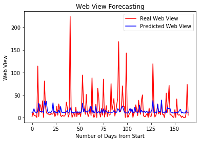

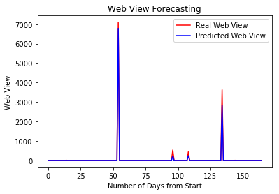

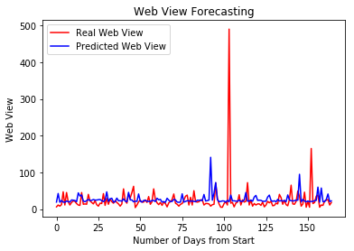


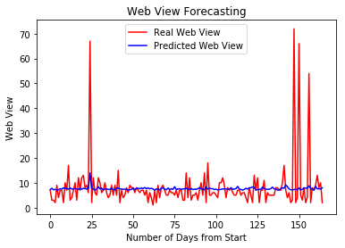

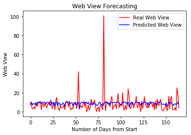

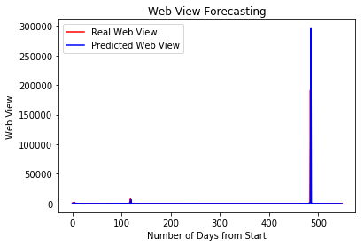


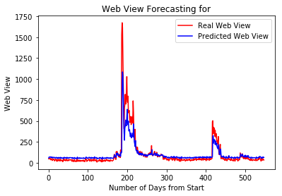

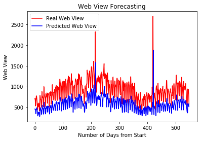


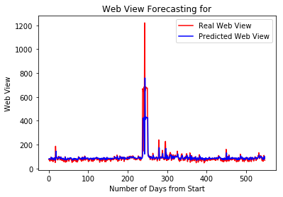


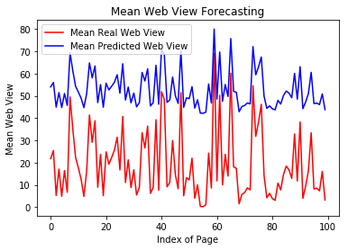

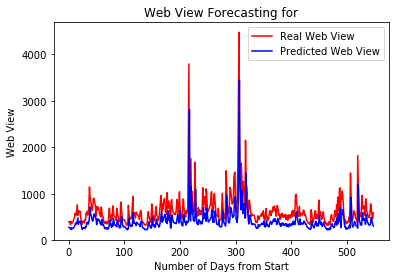


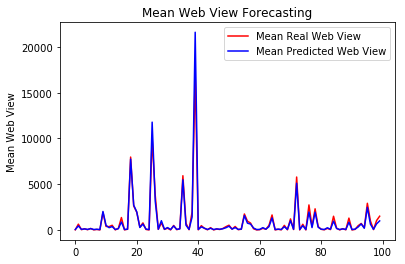

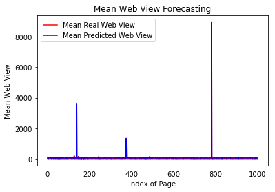

数据截图,数据位为维基百科网站部分网址在2015-2016年中的551天每天的访问量数字,数据为谷歌所有,在此不公开,需要数据请去谷歌举办的"网络流量时间序列预测"比赛网站中下载<br />

在波动较大时,预测准确度较低,实际上,若是这已经不是普通人空想就可以预测到的了数据中只有每天的访问量,只靠单纯的数字推导,使用简单的模型,有这样的精确度已经能使人感受到机器学习在网络中的应用的其中之一，网站压力预测。<br />

**Bert+注意力导向(attention guide)机制做舆情监测任务**

代码较长，在此贴出预训练模型拟合数据的训练代码（省略数据清理与停用词，部分重复代码函数化代码）<br />

```
module_url = "https://tfhub.dev/tensorflow/bert_en_uncased_L-24_H-1024_A-16/1"
bert_layer = hub.KerasLayer(module_url, trainable=True)
vocab_file = bert_layer.resolved_object.vocab_file.asset_path.numpy()
do_lower_case = bert_layer.resolved_object.do_lower_case.numpy()
tokenizer = tokenization.FullTokenizer(vocab_file, do_lower_case)
train_input = bert_encode(train.text.values, tokenizer, max_len=160)
test_input = bert_encode(test.text.values, tokenizer, max_len=160)
train_labels = train.target.values
model = build_model(bert_layer, max_len=160)
model.summary()
```
打印F1和loss值（每batch）
```
metrics=pd.DataFrame(model.history.history)
metrics
```

可以看出结果接近98%，Bert非常强力，也是因为此数据量较大的缘故，这里的源码由Prateek  Maheshwari分享。<br />

##### 3.讨论

以上就是我对于计算机网络中的人工智能技术的探索,真正的"计算机网络"与人工智能的结合,并不是空穴来风,在更低层,思科公司在前年就提出了AI驱动的IBN项目中的AI驱动(Intent-Based Networking)意图导向互联[白皮书链接](https://www.cisco.com/c/dam/en/us/solutions/collateral/enterprise-networks/digital-network-architecture/nb-09-intent-networking-wp-cte-en.pdf)

John Apostolopoulos博士对此进行了深刻的讨论
AI有什么帮助呢？它从顶部开始，编纂了IBN的核心–网络运营商的意图。运营商以人类语言或通过更传统的界面表达的意图必须转化为网络和安全策略。此步骤可以使用自然语言处理（NLP）以及机器学习（ML）和机器推理（MR）的形式。通常，使用机器推理来利用特定于网络的领域知识来确定如何在给定的网络环境中实现所需的意图通常尤其重要。<br />

然后启动激活步骤。它需要上一步编写的网络和安全策略，并将它们与对网络基础结构的深刻理解相结合，其中包括有关其当前行为的实时和历史数据。然后，它激活或自动化所有网络基础架构元素中的策略，理想情况下针对性能，可靠性和安全性进行优化。<br />

在我们的示例中，激活步骤决定了如何在全球网络的每个基础架构元素上提供服务质量（QoS），以提供所需的高质量视频，同时确保其他重要的网络任务也按预期运行。激活还可以应用ML来预测视频通话时员工在全球的位置，因此它可以根据他们的位置提供足够的带宽和处理能力。提前准确地确定哪些区域将有与会者在办公室中，以及哪些区域将有更多家庭或移动设备上的员工，可以显着改善用户的体验以及网络本身的成本效益。<br />

在某些情况下，甚至有可能预测用户的位置可能没有足够的带宽。可以提前通知他们，如果他们想要视频，应该去办公室，否则他们可能只会收到音频。<br />

但是，由AI驱动的网络设备激活有多好？它如何适应实时网络变化？保证组件是检查网络是否正在提供意图调用的服务以及激活步骤实现的组件。<br />

首先，“保证”步骤使用AI仅显示可能适用于当前问题的因素，处理大量的实时数据。例如，Assurance将监视网络上所有设备的启动时间（连接到Wi-Fi接入点的时间）。保证会告诉我们特定地区的入职时间是否超出正常波动范围，这可能是服务问题，安全入侵或其他因素造成的。<br />

在我们的全球全方位视频会议期间，会议开始时与会人员的数量可能会大幅增加。有了Assurance系统中的ML，我们可以确定何时出现异常的上班时间是一个问题，还是仅反映了全球范围内的全程视频会议。<br />

通过使用ML和MR，Assurance还可以筛选与全局事件相关的大量数据，以正确识别是否出现任何问题。然后，我们可以比以前更快，更可靠地获得针对这些问题的解决方案，甚至可以自动应用解决方案。例如，Assurance可以确定到某些站点的WAN带宽正在以使网络路径饱和的速率增加，并且可以主动地通过替代路径重新路由某些流，以防止问题发生。在现有系统中，通常仅在出现带宽瓶颈并且用户体验到通话质量下降甚至失去与会议的连接之后才能识别此问题。实时识别问题将具有挑战性或不可能，在它分散会议经验之前，对其进行修复的工作要少得多。通过ML和MR进行准确，快速的识别，并通过反馈回路进行智能自动化，是取得成功结果的关键。<br />

我们能够成功执行保证的原因有很多。首先，我们在设计，运行和调试网络方面拥有非常深厚的专业知识。其次，我们从ASIC，OS和软件级别设计了网络设备，以通过IBN架构收集关键数据，该架构提供统一的数据收集并在整个网络（有线，无线，LAN，WAN，数据中心）执行算法分析。第三，由于我们在过去20多年中一直是企业网络的第一大供应商，因此我们拥有大量的网络数据，包括问题数据库和相关的根本原因。第四，我们已经进行了多年的投资，以创建创新的网络数据分析以及ML，MR和其他AI技术来识别和解决关键问题。<br />

这些功能的组合使我们的产品能够快速确定问题是否存在，相关的根本原因，并确定解决问题的解决方案。网络运营商可以接受建议的修补程序，然后将其应用。反馈循环仍在继续，我们将收集更多数据以确定网络是否按预期运行。如果没有，我们将找出原因并继续改善网络。<br />
AI放大基于意图的网络的强大功能：从我这可以加速路径ntent成翻译和激活，然后检查在网络和行为数据保证步骤，以确保一切正常。激活利用这些见解来驱动更智能的操作，以提高性能，可靠性和安全性，从而形成网络优化的良性循环。诸如SDN之类的现有体系结构仅具有自动化的前馈路径。<br />

我还想强调指出，IT用户从具有AI的IBN系统中获得的反馈并不是大量的遥测数据；而是，相反，它是大规模有价值的，可操作的见解，源于使用AI的大量数据和行为分析。反馈回路说明了IBN和AI如何以前所未有的方式彼此放大。<br />

预计在不久的将来，IBN网络将提供更多激动人心的AI功能。<br />
4.总结
人工智能（AI）将改变一切。这不仅仅是炒作。技术不断进步，并且随着智能技术，无线连接和物联网（ IoT）的广泛集成，AI的定位是将所有技术整合到一个复杂的网络中，这是前所未有的。<br />
从网络工程的角度来看，人工智能具有管理速度和精度的网络以及将消费者整合到更广泛的信息和服务网络中的潜力。这样做为新型的客户体验策略创造了途径，这种策略已超越移动设备，进入了现实世界。<br />
与经验丰富的网络专家相比，可以监控跨有线和无线基础架构的数据传输以指数级的速度进行改进和故障排除。仍然需要人机交互，但是将以更有效的方式进行部署。AI可能不会花时间来确定网络问题的来源，而可能会迅速将问题归零，从而让IT员工来处理解决方案。
我相信,计算机网络中的人工智能技术会给我们带来一个更美好的明天。<br />
