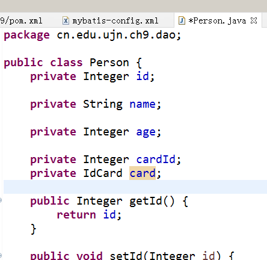

“别名”

```
<typeAliases>
		<package name="cn.edu.ujn.ch9.dao" />
</typeAliases>
前缀省略
```


一对一

人查身份账号

解决一对一->声明对象



person中加入card对象生成getter&setter

```
		<association property="card" column="card_id" javaType="cn.edu.ujn.ch9.dao.IdCard" select="cn.edu.ujn.ch9.dao.IdCardMapper.selectByPrimaryKey"></association>
```

目的 与    在Person.java中的(刚才写的那个)赋值

```
private IdCard card;
```


赋值

调用了


嵌套结果

