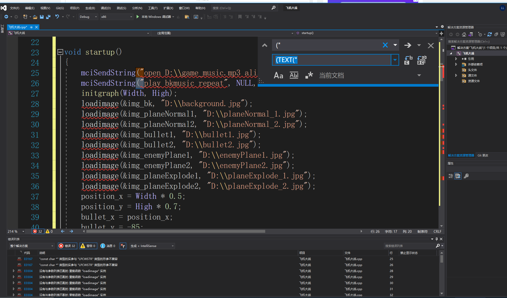
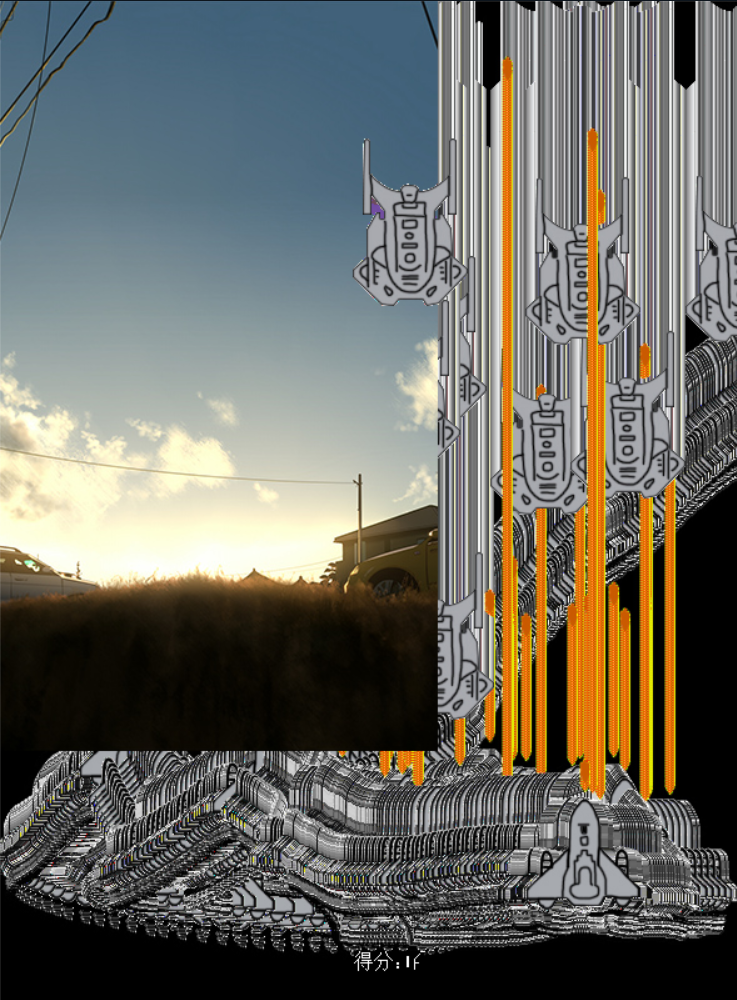
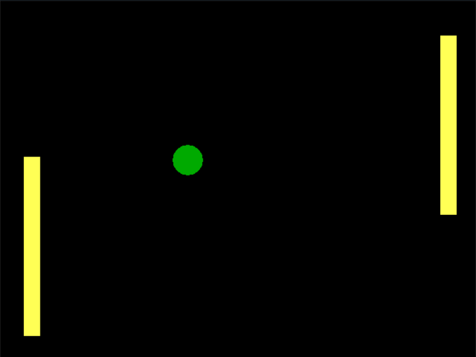

# flappy Bird

问题 鸟图片按照书上代码遮挡后会发黑 想显示过了几根杆子得分  显示乱码 但是不强制转格式已经无法按照原先代码跑通 整体代码理解没有问题

```
#include<stdio.h>
#include<graphics.h>
#include<conio.h>
#pragma comment(lib,"Winmm.lib")
#define n 10
#define high 600
#define width 350


int score;
int bird_x, bird_y;//小鸟位置
int bar_up_x[n], bar_up_y[n];//上挡板的位置
int bar_down_x[n], bar_down_y[n];//下挡板的位置
IMAGE img_bd1, img_bd2, img_bk, img_bar_up1, img_bar_up2, img_bar_down1, img_bar_down2;


void starup()//游戏初始化 
{
	int i;
	int k = 1;//距离的倍数
	int l = 1;//距离的倍数
	mciSendString(TEXT("open E:\\background.mp3 alias bkmusic"), NULL, 0, NULL);//播放背景音乐
	mciSendString(TEXT("play bkmusic repeat"), NULL, 0, NULL);	//循环播放


	initgraph(width, high);
	loadimage(&img_bk, TEXT("E:\\background.jpg"));//读取图片到img对象中
	loadimage(&img_bd1, TEXT("E:\\bird1.jpg"));
	loadimage(&img_bd2, TEXT("E:\\flappy birdbird2.jpg"));
	loadimage(&img_bar_up1, TEXT("E:\\bar_up1.gif"));
	loadimage(&img_bar_up2, TEXT("E:\\bar_up2.gif"));
	loadimage(&img_bar_down1, TEXT("E:\\bar_down1.gif"));
	loadimage(&img_bar_down2, TEXT("E:\\bar_down2.gif"));

	bird_x = 50;
	bird_y = 200;

	bar_up_x[0] = 300;
	bar_down_x[0] = 300;
	bar_up_y[0] = -300;
	bar_down_y[0] = 400;

	score = 0;

	for (i = 1; i < n; i++)
	{
		k++;
		bar_up_x[i] = bar_up_x[0] * k;
		bar_up_y[i] = -300 - (rand() % 100);

		bar_down_x[i] = bar_down_x[0] * k;
		bar_down_y[i] = 400 + (rand() % 100);
	}

	BeginBatchDraw();
}


void show()
{
	int i, j;

	putimage(0, 0, &img_bk); //显示背景
	for (i = 0; i < n; i++)
	{
		putimage(bar_up_x[i], bar_up_y[i], &img_bar_up1, NOTSRCERASE);//显示上一半的障碍物
		putimage(bar_up_x[i], bar_up_y[i], &img_bar_up2, SRCINVERT);
	}


	for (j = 0; j < n; j++)
	{
		putimage(bar_down_x[j], bar_down_y[j], &img_bar_down1, NOTSRCERASE);//显示下一半的障碍物
		putimage(bar_down_x[j], bar_down_y[j], &img_bar_down2, SRCINVERT);
	}
	putimage(bird_x, bird_y, &img_bd1, NOTSRCERASE);//显示小鸟
	putimage(bird_x, bird_y, &img_bd2, SRCINVERT);

	/*outtextxy(10, 10, TEXT("得分：自己数！"));*/
	char s[5];
	sprintf_s(s,"%d",score);
	outtextxy(50,10,score);

	FlushBatchDraw();
	Sleep(25);
}


void updataWithoutInput()//用户无关设置
{
	int i, j;

	for (i = 0; i < n; i++)		//碰瓷而死
	{
		bar_up_x[i] = bar_up_x[i] - 1;
		bar_down_x[i] = bar_down_x[i] - 1;

		if ((bird_x > bar_up_x[i] - 30) && (bird_x < bar_up_x[i] + 140))
		{
			if ((bird_y < 600 + bar_up_y[i]) || (bird_y > bar_down_y[i] - 15))
			{
				EndBatchDraw();

				setfillcolor(BLACK);
				solidrectangle(0, 0, width, high);

				outtextxy(width / 2 - 30, high / 2, TEXT("游戏结束！"));
				outtextxy(width / 2 - 30, high / 2 + 50, TEXT("按任意键退出"));

				_getch();
				closegraph();
			}
		}
	}

	for (j = 0; j < n; j++)
	{
		if (bar_up_x[j] == 50)
			score++;
	}


	if (bird_y > high - 15)		//落入无底深渊die
	{
		EndBatchDraw();

		setfillcolor(BLACK);
		solidrectangle(0, 0, width, high);

		outtextxy(width / 2 - 30, high / 2, TEXT("游戏结束！"));
		outtextxy(width / 2 - 30, high / 2 + 50, TEXT("按任意键退出"));

		_getch();
		closegraph();
	}
	else
		bird_y = bird_y + 3;


}


void updataWithInput()//用户有关设置
{
	char input;
	if (_kbhit())//当按下键时执行
	{
		input = _getch();
		if (input == ' ' && bird_y > 20)
		{
			bird_y = bird_y - 60;

			mciSendString(TEXT("close jpmusic"), NULL, 0, NULL);//先把前面一次的音乐关闭
			mciSendString(TEXT("open E:\\Jump.mp3 alias jpmusic"), NULL, 0, NULL);//打开音乐
			mciSendString(TEXT("play jpmusic"), NULL, 0, NULL);//仅播放一次
		}
	}
}

void gameover()
{
	EndBatchDraw();
	_getch();
	closegraph();
}


void main()
{
	starup();//数据初始化
	while (1)//游戏循环 
	{
		show();//游戏显示 
		updataWithoutInput();//用户无关设置 
		updataWithInput(); //用户有关设置 
	}
	gameover();
}

```

# 飞机大战

问题 背景未自适应拉伸  我方飞机 子弹 敌方飞机都有几率重影 得分乱码 不能显示  abs()函数已经不能读取整形以外任何形式 无奈只能强制类型转换 在击中判定上有些问题 容易很多枪打不死 飞机爆炸 游戏结束没问题 整体流程没有问题  整体代码理解没有问题

```
#include <graphics.h>
#include <conio.h>
#include <math.h>
#include <stdio.h>

// 引用 Windows Multimedia API
#pragma comment(lib,"Winmm.lib")

#define High 800  // 游戏画面尺寸
#define Width 590

IMAGE img_bk; // 背景图片
float position_x, position_y; // 飞机位置
float bullet_x, bullet_y; // 子弹位置
float enemy_x, enemy_y; // 敌机位置
IMAGE img_planeNormal1, img_planeNormal2; // 正常飞机图片
IMAGE img_planeExplode1, img_planeExplode2; // 爆炸飞机图片
IMAGE img_bullet1, img_bullet2; // 子弹图片
IMAGE img_enemyPlane1, img_enemyPlane2; // 敌机图片
int isExpolde = 0; // 飞机是否爆炸
int score = 0; // 得分

void startup()
{
	mciSendString(TEXT("open E:\\game_music.mp3 alias bkmusic"), NULL, 0, NULL);//打开背景音乐
	mciSendString(TEXT("play bkmusic repeat"), NULL, 0, NULL);  // 循环播放
	initgraph(Width, High);
	loadimage(&img_bk, TEXT("E:\\background1.jpg"));
	loadimage(&img_planeNormal1, TEXT("E:\\planeNormal_1.jpg"));
	loadimage(&img_planeNormal2, TEXT("E:\\planeNormal_2.jpg"));
	loadimage(&img_bullet1, TEXT("E:\\bullet1.jpg"));
	loadimage(&img_bullet2, TEXT("E:\\bullet2.jpg"));
	loadimage(&img_enemyPlane1, TEXT("E:\\enemyPlane1.jpg"));
	loadimage(&img_enemyPlane2, TEXT("E:\\enemyPlane2.jpg"));
	loadimage(&img_planeExplode1, TEXT("E:\\planeExplode_1.jpg"));
	loadimage(&img_planeExplode2, TEXT("E:\\planeExplode_2.jpg"));
	position_x = Width * 0.5;
	position_y = High * 0.7;
	bullet_x = position_x;
	bullet_y = -85;
	enemy_x = Width * 0.5;
	enemy_y = 10;
	BeginBatchDraw();
}

void show()
{
	putimage(0, 0, &img_bk);	// 显示背景	
	if (isExpolde == 0)
	{
		putimage(position_x - 50, position_y - 60, &img_planeNormal1, NOTSRCERASE); // 显示正常飞机	
		putimage(position_x - 50, position_y - 60, &img_planeNormal2, SRCINVERT);

		putimage(bullet_x - 7, bullet_y, &img_bullet1, NOTSRCERASE); // 显示子弹	
		putimage(bullet_x - 7, bullet_y, &img_bullet2, SRCINVERT);
		putimage(enemy_x, enemy_y, &img_enemyPlane1, NOTSRCERASE); // 显示敌机	
		putimage(enemy_x, enemy_y, &img_enemyPlane2, SRCINVERT);
	}
	else
	{
		putimage(position_x - 50, position_y - 60, &img_planeExplode1, NOTSRCERASE); // 显示爆炸飞机	
		putimage(position_x - 50, position_y - 60, &img_planeExplode2, SRCINVERT);
	}
	outtextxy(Width * 0.48, High * 0.95, TEXT("得分："));
	char s[5];
	sprintf_s(s, "%d", score);
	outtextxy(Width * 0.55, High * 0.95, score);
	//outtextxy(50, 10, score);
	FlushBatchDraw();
	Sleep(2);
}

void updateWithoutInput()
{
	if (isExpolde == 0)
	{
		if (bullet_y > -25)
			bullet_y = bullet_y - 2;

		if (enemy_y < High - 25)
			enemy_y = enemy_y + 0.5;
		else
			enemy_y = 10;
		if (abs(int(bullet_x) - int(enemy_x)) + abs(int(bullet_y - enemy_y)) < 80)  // 子弹击中敌机
		{
			enemy_x = rand() % Width;
			enemy_y = -40;
			bullet_y = -85;
			mciSendString(TEXT("close gemusic"), NULL, 0, NULL); // 先把前面一次的音乐关闭
			mciSendString(TEXT("open E:\\gotEnemy.mp3 alias gemusic"), NULL, 0, NULL); // 打开音乐
			mciSendString(TEXT("play gemusic"), NULL, 0, NULL); // 仅播放一次
			score++;
			if (score > 0 && score % 5 == 0 && score % 2 != 0)
			{
				mciSendString(TEXT("close 5music"), NULL, 0, NULL); // 先把前面一次的音乐关闭
				mciSendString(TEXT("open E:\\5.mp3 alias 5music"), NULL, 0, NULL); // 打开音乐
				mciSendString(TEXT("play 5music"), NULL, 0, NULL); // 仅播放一次
			}
			if (score % 10 == 0)
			{
				mciSendString(TEXT("close 10music"), NULL, 0, NULL); // 先把前面一次的音乐关闭
				mciSendString(TEXT("open E:\\10.mp3 alias 10music"), NULL, 0, NULL); // 打开音乐
				mciSendString(TEXT("play 10music"), NULL, 0, NULL); // 仅播放一次
			}
		}

		if (abs(int(position_x - enemy_x)) + abs(int(position_y - enemy_y)) < 150)  // 敌机击中我们
		{
			isExpolde = 1;
			mciSendString(TEXT("close exmusic"), NULL, 0, NULL); // 先把前面一次的音乐关闭
			mciSendString(TEXT("open E:\\explode.mp3 alias exmusic"), NULL, 0, NULL); // 打开音乐
			mciSendString(TEXT("play exmusic"), NULL, 0, NULL); // 仅播放一次		
		}
	}
}

void updateWithInput()
{
	if (isExpolde == 0)
	{
		MOUSEMSG m;		// 定义鼠标消息
		while (MouseHit())  //这个函数用于检测当前是否有鼠标消息
		{
			m = GetMouseMsg();
			if (m.uMsg == WM_MOUSEMOVE)
			{
				// 飞机的位置等于鼠标所在的位置
				position_x = m.x;
				position_y = m.y;
			}
			else if (m.uMsg == WM_LBUTTONDOWN)
			{
				// 按下鼠标左键，发射子弹
				bullet_x = position_x;
				bullet_y = position_y - 85;
				mciSendString(TEXT("close fgmusic"), NULL, 0, NULL); // 先把前面一次的音乐关闭
				mciSendString(TEXT("open E:\\f_gun.mp3 alias fgmusic"), NULL, 0, NULL); // 打开音乐
				mciSendString(TEXT("play fgmusic"), NULL, 0, NULL); // 仅播放一次
			}
		}
	}
}

void gameover()
{
	EndBatchDraw();
	_getch();
	closegraph();
}

int main()
{
	startup();  // 数据初始化	
	while (1)  //  游戏循环执行
	{
		show();  // 显示画面
		updateWithoutInput();  // 与用户输入无关的更新
		updateWithInput();     // 与用户输入有关的更新
	}
	gameover();     // 游戏结束、后续处理
	return 0;
}

```






# 双人游戏

```
#include <conio.h>
#include <graphics.h>
#include<windows.h>
#define High 480  // 游戏画面尺寸
#define Width 640
// 全局变量
int ball_x, ball_y; // 小球的坐标
int ball_vx, ball_vy; // 小球的速度
int radius; // 小球的半径
int bar1_left, bar1_right, bar1_top, bar1_bottom; // 挡板1的上下左右位置坐标
int bar2_left, bar2_right, bar2_top, bar2_bottom; // 挡板2的上下左右位置坐标
int bar_height, bar_width; // 挡板的高度、宽度

void startup()  // 数据初始化
{
	ball_x = Width / 2;
	ball_y = High / 2;
	ball_vx = 1;
	ball_vy = 1;
	radius = 20;

	bar_width = Width / 30;
	bar_height = High / 2;

	bar1_left = Width * 1 / 20;
	bar1_top = High / 4;
	bar1_right = bar1_left + bar_width;
	bar1_bottom = bar1_top + bar_height;

	bar2_left = Width * 18.5 / 20;
	bar2_top = High / 4;
	bar2_right = bar2_left + bar_width;
	bar2_bottom = bar2_top + bar_height;

	initgraph(Width, High);
	BeginBatchDraw();
}

void clean()  // 消除画面
{
	setcolor(BLACK);
	setfillcolor(BLACK);
	fillcircle(ball_x, ball_y, radius);
	fillcircle(ball_x, ball_y, radius);
	bar(bar1_left, bar1_top, bar1_right, bar1_bottom);
	bar(bar2_left, bar2_top, bar2_right, bar2_bottom);
}

void show()  // 显示画面
{
	setcolor(GREEN);
	setfillcolor(GREEN);
	fillcircle(ball_x, ball_y, radius);	// 绘制绿圆	

	setcolor(YELLOW);
	setfillcolor(YELLOW);
	bar(bar1_left, bar1_top, bar1_right, bar1_bottom);	// 绘制黄色挡板
	bar(bar2_left, bar2_top, bar2_right, bar2_bottom);

	FlushBatchDraw();
	// 延时
	Sleep(3);
}

void updateWithoutInput()  // 与用户输入无关的更新
{
	// 挡板和小圆碰撞，小圆反弹
	if (ball_x + radius >= bar2_left && ball_y + radius >= bar2_top && ball_y + radius <= bar2_bottom)
		ball_vx = -ball_vx;
	else if (ball_x - radius <= bar1_right && ball_y + radius >= bar1_top && ball_y + radius <= bar1_bottom)
		ball_vx = -ball_vx;

	// 更新小圆坐标
	ball_x = ball_x + ball_vx;
	ball_y = ball_y + ball_vy;

	if ((ball_x <= radius) || (ball_x >= Width - radius))
		ball_vx = -ball_vx;
	if ((ball_y <= radius) || (ball_y >= High - radius))
		ball_vy = -ball_vy;
}

void updateWithInput()  // 与用户输入有关的更新
{
	int step = 1;
	if (GetAsyncKeyState(0x57) & 0x8000)  // w
		bar1_top -= step;
	if ((GetAsyncKeyState(0x53) & 0x8000)) //s
		bar1_top += step;
	if ((GetAsyncKeyState(VK_UP) & 0x8000))     // 上方向键
		bar2_top -= step;
	if ((GetAsyncKeyState(VK_DOWN) & 0x8000))  // 下方向键
		bar2_top += step;

	bar1_bottom = bar1_top + bar_height;
	bar2_bottom = bar2_top + bar_height;
}

void gameover()
{
	EndBatchDraw();
	closegraph();
}

int main()
{
	startup();  // 数据初始化	
	while (1)  //  游戏循环执行
	{
		clean();  // 把之前绘制的内容取消
		updateWithoutInput();  // 与用户输入无关的更新
		updateWithInput();     // 与用户输入有关的更新
		show();  // 显示新画面
	}
	gameover();     // 游戏结束、后续处理
	return 0;
}

```




conio函数介绍

```
C语言图形函数(一)
C语言图形编程(一,字符屏幕)
一,屏幕操作函数
1. clrscr()清除字符窗口函数
2. window()字符窗口函数
3. gotoxy()光标定位函数
4. clreol() 清除光标行尾字符函数
5. insline() 插入空行函数
6. delline() 删除一行函数
7. gettext() 拷进文字函数
8. puttext() 拷出文字函数
9. movetext() 移动文字函数
二,字符属性函数
10. textmode() 文本模式函数 
11. highvideo()高亮度函数 
12. lowvideo() 低亮度函数
13. normvideo(void);
14. textcolor() 文本颜色函数
15. textattr() 文本属性函数
16.textbackground() 文本背景函数
三, 屏显状态函数
17. wherex() 光标处x坐标函数
18. wherey() 光标处y坐标函数
19. gettextinfo() 获取文本窗口信息函数


1. clrscr()清除字符窗口函数
功能:函数clrscr()清除整个当前字符窗口,并且把光标定位于左上角(1,1)处.
用法:此函数调用方式为 void clrscr(void);
说明:括号中void 表示无参数


2. window()字符窗口函数
功能: 函数window()用于在指定位置建立一个字符窗口.
用法: 此函数调用方式为 void window(int left,int top,int right,int bottom);


3. gotoxy()光标定位函数
功能: 函数gotoxy()将字屏幕上的光标移到当前窗口指定的位置上.
用法: 这个函数调用方式为void gotoxy(int x,int y);
说明: 括号里x,y是, 光标定位的坐标,如果其中一个坐标值无效(如坐标超界),那么光标不会移动.
此函数在字符状态(有时称为文本状态)下经常用到 ,其相应的头文件为conio.h
返回值:无
```


## 总结

暴露出来了我VS2019使用的较少 不够熟练得问题 之后的unity开发还需要慎重选择IDE

C,C++代码补全 包括Kite配置都没有完全配好 C++方面在算法比赛之后没有过接触 生疏 部分代码刻板问题得不到解决方法,只能摸索着自己解决

另一方面 代码理解相对简单 比较而言仅easyx和conio与压力不算大
