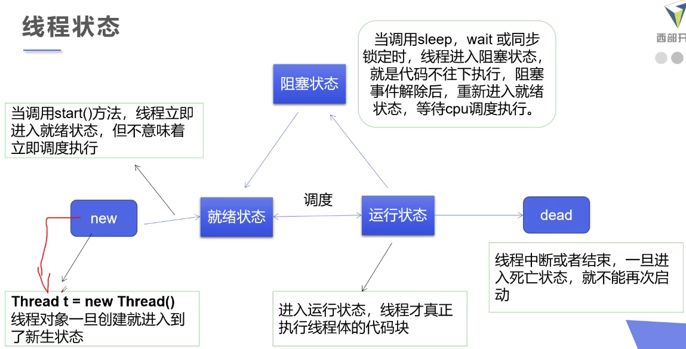

### 编码规范化
#### 多线程 多任务


## 实在惭愧 罚抄10遍(x)


两种方法


```
public class SP {
    public static void main(String[] args) {

        WeddingCompany weddingCompany = new WeddingCompany(new you());
        weddingCompany.HappyMarry();
    }
}

interface Marry {
    void HappyMarry();
}

class you implements Marry {

    public void HappyMarry() {
        System.out.println("我要结婚了!");
    }
}

class WeddingCompany implements Marry {
    private Marry target;

    WeddingCompany(Marry target) {
        this.target = target;
    }

    public void HappyMarry() {
        before();
        this.target.HappyMarry();
        after();
    }

    private void after() {
        System.out.println("结婚之后收尾款");
    }

    private void before() {
        System.out.println("结婚之前布置现场");
    }
}

```


#### Lamba表达式


#### 函数式接口
#### Functional Interface
定义 任何接口 如果只包含一一个抽象方法,那么他是一个函数式接口  

```

public class Testlambda1 {
    static class Like2 implements ILike {
        @Override
        public void lambda() {
            System.out.println("I Like Lambda 2!");
        }
    }

    public static void main(String[] args) {
        ILike like = new Like();
        like.lambda();
        Like2 like2 = new Like2();
        like2.lambda();
        class Like3 implements ILike {
            @Override
            public void lambda() {
                System.out.println("I Like Lambda 3!");
            }
        }
        Like3 like3 = new Like3();
        like3.lambda();
        like = new ILike() {

            @Override
            public void lambda() {
                System.out.println("I Like Lambda 4!");
            }
        };
        like.lambda();
        like=()-> {
            System.out.println("I Like Lambda 5!");
        };
        like.lambda();
    }
}

interface ILike {
    void lambda();
}

class Like implements ILike {
    @Override
    public void lambda() {
        System.out.println("I Like Lambda!");
    }
}

```


```

public class Testlambda3 {
    static class Love2 implements Ilove {

        @Override
        public void love(int a) {
            System.out.println("I love you 2 -->" + a);
        }
    }

    public static void main(String[] args) {
        class Love3 implements Ilove {
            @Override
            public void love(int a) {
                System.out.println("I love you 3 -->" + a);
            }
        }

        Ilove love4 = new Ilove() {
            @Override
            public void love(int a) {
                System.out.println("I love you 4 -->" + a);
            }
        };
        Ilove love5 = (int a) -> {
            System.out.println("I love you 5 -->" + a);
        };
        love5.love(1823);
    }
}

interface Ilove {
    void love(int a);

}

class Love implements Ilove {

    @Override
    public void love(int a) {
        System.out.println("I love you 1 -->" + a);
    }
}

```

#### 五大状态



