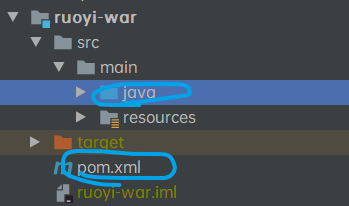
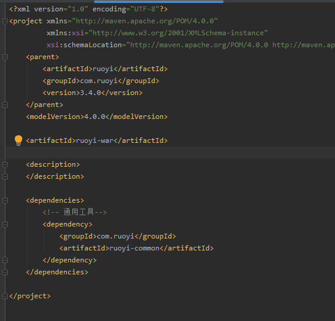
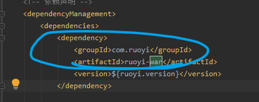
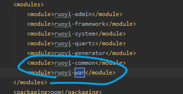
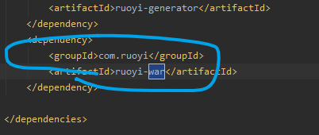

## 新建子模块

`Maven`多模块下新建子模块流程案例。

1、新建业务模块目录，例如：`ruoyi-war`。

2、在`ruoyi-war`业务模块下新建`pom.xml`文件以及`src\main\java`，`src\main\resources`目录。

cc

`pom.xml`文件(sample)

3、根目录`pom.xml`依赖声明节点`dependencies`中添加依赖

4、根目录`pom.xml`模块节点`modules`添加业务模块

5、`ruoyi-admin`目录`pom.xml`添加模块依赖

6、测试模块

在`ruoyi-test`业务模块添加`com.ruoyi.test`包，新建`TestService.java`

在`ruoyi-admin`新建测试类，调用`helloTest`成功返回`hello`代表成功。s32g2y

